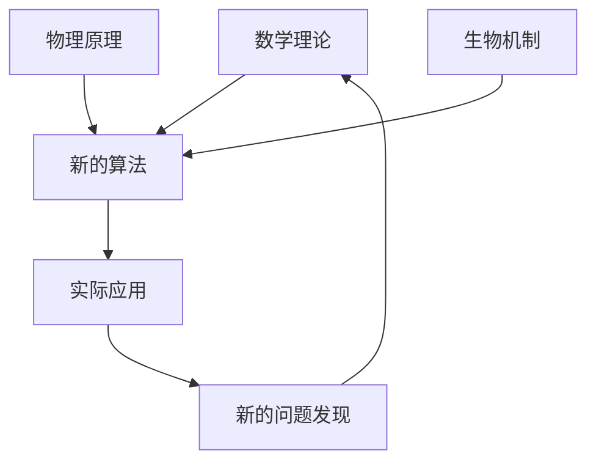

# 关于研究创新的一些思考

在多年的研究工作中，我深深体会到创新并非一朝一夕的灵光乍现，而是一个需要长期积累和深度思考的过程。今天想分享一些关于研究创新的个人思考。

## 创新的本质是什么？

### 问题导向vs技术驱动

很多时候，我们容易陷入"技术驱动"的误区——先有了一个新技术，然后去找能应用的场景。但真正有价值的创新往往是"问题导向"的：

- **发现真正的问题**：不是所有问题都值得解决
- **理解问题的本质**：表面现象背后的深层原因
- **评估解决方案的价值**：技术可行性vs实际需求

### 跨学科的视角

创新往往发生在学科交叉的边界：



我们需要保持开放的心态，从其他领域汲取灵感。比如：
- 从生物学习得的神经网络
- 从物理学借鉴的优化算法
- 从心理学启发的人机交互设计

## 研究创新的方法论

### 1. 深度阅读与广度探索

**深度阅读**：
- 不仅要知道"是什么"，更要理解"为什么"
- 追溯技术发展的历史脉络
- 理解每一个设计选择背后的原因

**广度探索**：
- 关注相关领域的最新进展
- 参加不同学科的学术会议
- 与其他领域的研究者交流

### 2. 从失败中学习

很多重要的发现都来自于"失败"的实验：

```python
def research_experiment():
    hypothesis = generate_hypothesis()
    experiment = design_experiment(hypothesis)
    result = run_experiment(experiment)
    
    if result.success:
        return analyze_success(result)
    else:
        # 失败往往比成功更有价值
        insight = analyze_failure(result)
        new_hypothesis = refine_hypothesis(hypothesis, insight)
        return research_experiment()  # 迭代改进
```

失败教会我们：
- 假设的局限性
- 方法的适用边界
- 新的研究方向

### 3. 建立系统性思维

把问题放在更大的系统中考虑：

- **上游**：这个问题的输入是什么？
- **下游**：解决方案会产生什么影响？
- **横向**：相关的并行问题有哪些？
- **纵向**：问题的抽象层次如何？

## 跨学科合作的重要性

### 打破学科壁垒

现代科学问题的复杂性往往超出单一学科的范围：

| 学科组合 | 可能的创新方向 |
|---------|---------------|
| CS + Biology | 生物信息学、合成生物学 |
| CS + Physics | 量子计算、复杂系统建模 |
| CS + Psychology | 人机交互、认知计算 |
| CS + Economics | 算法博弈论、计算经济学 |

### 有效合作的要素

1. **共同语言**：建立跨学科的沟通桥梁
2. **互补技能**：各自贡献独特的专业知识
3. **开放心态**：愿意学习和理解其他领域
4. **明确目标**：对合作成果有共同期待

## 保持创新动力的策略

### 好奇心驱动

> "I have no special talent. I am only passionately curious." - Einstein

保持对未知的好奇心：
- 经常问"为什么是这样？"
- 质疑既有的假设和方法
- 探索看似不相关的领域

### 持续学习

技术发展日新月异，需要建立终身学习的习惯：

```python
class Researcher:
    def __init__(self):
        self.knowledge_base = initialize_expertise()
        self.learning_rate = 0.1
    
    def daily_routine(self):
        # 每天的学习和思考
        new_papers = read_latest_papers()
        insights = extract_insights(new_papers)
        self.knowledge_base.update(insights)
        
        # 定期反思和整理
        if self.is_weekly_review():
            self.knowledge_base = reorganize_knowledge()
        
        return self.generate_new_ideas()
```

### 建立反馈循环

- **学术交流**：参加会议、研讨会
- **同行评议**：论文投稿和审稿过程
- **实际应用**：将研究成果转化为实用价值
- **教学相长**：通过教学深化理解

## 创新过程中的常见陷阱

### 1. 过度追求新颖性

新颖≠有价值。有时候，对已有方法的深度改进比全新的方法更有意义。

### 2. 忽视实用性

纯理论研究有其价值，但也要考虑研究成果的可转化性和社会影响。

### 3. 缺乏耐心

创新需要时间积累，急于求成往往适得其反。

### 4. 闭门造车

缺乏与外界的交流，容易陷入思维局限。

## 对年轻研究者的建议

### 找到自己的研究风格

每个人都有不同的优势：
- **理论型**：擅长抽象思维和数学推导
- **实验型**：喜欢动手实践和验证
- **应用型**：关注实际问题的解决
- **综合型**：能够整合多方面的知识

### 建立长期视角

研究是一个长期的过程：
- 不要被短期的挫折击倒
- 保持对长远目标的专注
- 在坚持中寻找突破点

### 平衡深度与广度

- **深度**：在某个领域建立扎实的基础
- **广度**：保持对其他领域的敏感性

## 创新的社会责任

### 技术伦理

随着技术的快速发展，我们需要考虑：
- 技术的社会影响
- 潜在的负面后果
- 公平性和包容性

### 知识传播

- 开放式研究：分享数据、代码、方法
- 科普教育：让更多人理解科学
- 国际合作：促进全球知识共享

## 结语

创新是一个永无止境的旅程。在这个过程中，我们不仅要追求技术的突破，更要保持对真理的敬畏、对社会的责任感，以及对未来的憧憬。

希望每一位研究者都能在自己的道路上找到属于自己的创新之光，为人类知识的大厦添砖加瓦。

---

*这些思考来自于个人的研究经历，不同的研究者可能会有不同的体会。欢迎分享您的研究心得和创新经验。* 